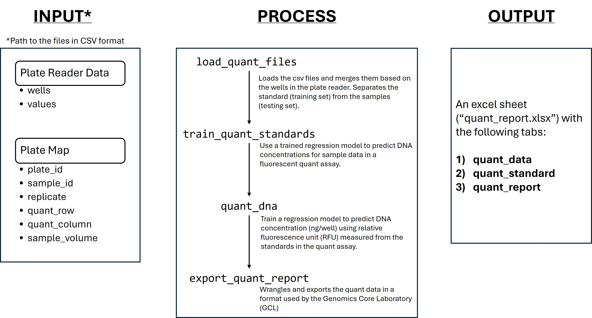

<!-- README.md is generated from README.Rmd. Please edit that file -->

```{r, include = FALSE}
knitr::opts_chunk$set(
  collapse = TRUE,
  comment = "#>",
  fig.path = "man/figures/README-",
  out.width = "100%"
)
```

# tamuccGCL

<!-- badges: start -->
<!-- badges: end -->

Collection of R functions to automate computational workflows in TAMU-CC Genomics Core Laboratory.

This package handles the following:

- Quant (AccuBlue, AccuClear) workflows 

## Installation

You can install the development version of tamuccGCL from [GitHub](https://github.com/) with:
```{r}
# install.packages("devtools")
devtools::install_github("kllabrador/tamuccGCL")
```


If, for some reason the package cannot be installed, please notify Kevin Labrador (klabrador@islander.tamucc.edu).


## Example - Quant Workflow

In a nutshell, the quant workflow takes the file path to the quant data files (in csv format) as input, trains the regression model based on the relative fluorescence unit (RFU) of the standards, and then uses the regression model to predict the DNA concentration of the samples. The output file which contains the quant report following the Genomics Core Lab's format is then generated. 

```{r fig.height=5, fig.width=7, echo=F}

```


The Quant workflow requires two data frames in comma-separated values (csv) format: (1) the plate reader data, and (2) the plate map. The **plate reader data** is the raw data exported from the SpectraMax software, and should contain the columns, `wells` and `values`. On the other hand, the **plate map** is a user-defined file that contains the well information and metadata associated with the samples in the assay. The data structure is specific and should only have the following columns: `plate_id`, `sample_id`, `replicate`, `quant_row`, `quant_column`, and `sample_volume`. 


```{r example}
require (tamuccGCL)

# Import data files
raw_data <- system.file("extdata", "raw_data.csv", package = "tamuccGCL") 
plate_map <- system.file("extdata", "plate_map.csv", package = "tamuccGCL")

# The files used in the example are included in the package. Substitute the arguments with the file path to your csv files. 
```


```{r}
quant_data <- load_quant_files(raw_data, plate_map)
trained_model <- train_quant_standards (quant_data)
quant_report <- quant_dna(quant_data = quant_data, trained_model = trained_model)
export_quant_report (quant_report)

```
