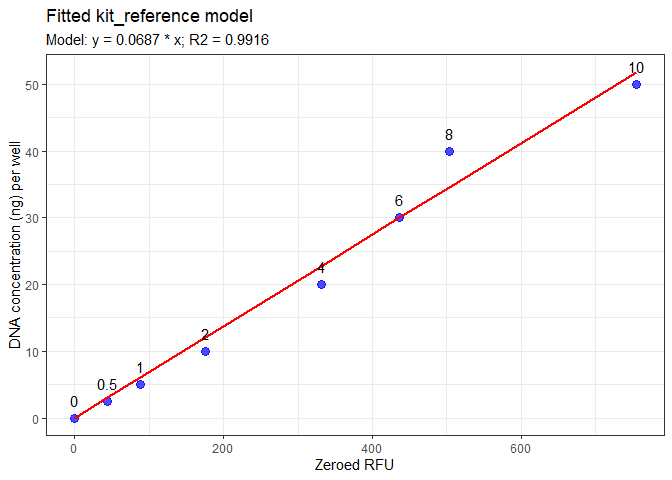

<!-- README.md is generated from README.Rmd. Please edit that file -->

# tamuccGCL

<!-- badges: start -->
<!-- badges: end -->

Collection of R functions to address computational workflows in TAMU-CC
Genomics Core Laboratory.

## Installation

You can install the development version of tamuccGCL from
[GitHub](https://github.com/) with:

``` r
# install.packages("devtools")
devtools::install_github("kllabrador/tamuccGCL")
```

## Example

This is a basic example of analyzing the quant data using the package.

``` r
require (tamuccGCL)
#> Loading required package: tamuccGCL
#> Loading required package: openxlsx
#> Loading required package: tidyverse
#> ── Attaching core tidyverse packages ──────────────────────── tidyverse 2.0.0 ──
#> ✔ dplyr     1.1.4     ✔ readr     2.1.5
#> ✔ forcats   1.0.0     ✔ stringr   1.5.1
#> ✔ ggplot2   3.5.1     ✔ tibble    3.2.1
#> ✔ lubridate 1.9.3     ✔ tidyr     1.3.1
#> ✔ purrr     1.0.2     
#> ── Conflicts ────────────────────────────────────────── tidyverse_conflicts() ──
#> ✖ dplyr::filter() masks stats::filter()
#> ✖ dplyr::lag()    masks stats::lag()
#> ℹ Use the conflicted package (<http://conflicted.r-lib.org/>) to force all conflicts to become errors
#> Loading required package: janitor
#> 
#> 
#> Attaching package: 'janitor'
#> 
#> 
#> The following objects are masked from 'package:stats':
#> 
#>     chisq.test, fisher.test

# Import data files
raw_data <- system.file("extdata", "raw_data.csv", package = "tamuccGCL")
plate_map <- system.file("extdata", "plate_map.csv", package = "tamuccGCL")

quant_data <- load_quant_files(raw_data, plate_map)
#> 8 standards detected
#> The standards used (in ng/ul) are: 0, 0.5, 1, 2, 4, 6, 8, 10
trained_model <- train_quant_standards (quant_data)
#> No replicate standards detected. Original RFU values are kept.
#> Fitted a kit_reference model.
#> Coefficients: zeroed_rfu = 0.0687
#> R-squared: 0.9916
```



``` r
quant_report <- quant_dna(quant_data = quant_data, trained_model = trained_model)
export_quant_report (quant_report)
#> Quant report exported successfully!
#> # A tibble: 8 × 18
#>   plate_id       sample_row sample_column quant_row_1 quant_column_1 quant_row_2
#>   <chr>          <chr>              <dbl> <chr>                <int> <chr>      
#> 1 Tepolt-ddRAD-… A                     12 O                        1 O          
#> 2 Tepolt-ddRAD-… B                     12 O                        3 O          
#> 3 Tepolt-ddRAD-… C                     12 O                        5 O          
#> 4 Tepolt-ddRAD-… D                     12 O                        7 O          
#> 5 Tepolt-ddRAD-… E                     12 O                        9 O          
#> 6 Tepolt-ddRAD-… F                     12 O                       11 O          
#> 7 Tepolt-ddRAD-… G                     12 O                       13 O          
#> 8 Tepolt-ddRAD-… H                     12 O                       15 O          
#> # ℹ 12 more variables: quant_column_2 <int>, raw_rfu_1 <dbl>,
#> #   zeroed_rfu_1 <dbl>, ng_well_1 <dbl>, ng_ul_1 <dbl>, raw_rfu_2 <dbl>,
#> #   zeroed_rfu_2 <dbl>, ng_well_2 <dbl>, ng_ul_2 <dbl>, difference <dbl>,
#> #   average <dbl>, pass_redo <chr>
```
