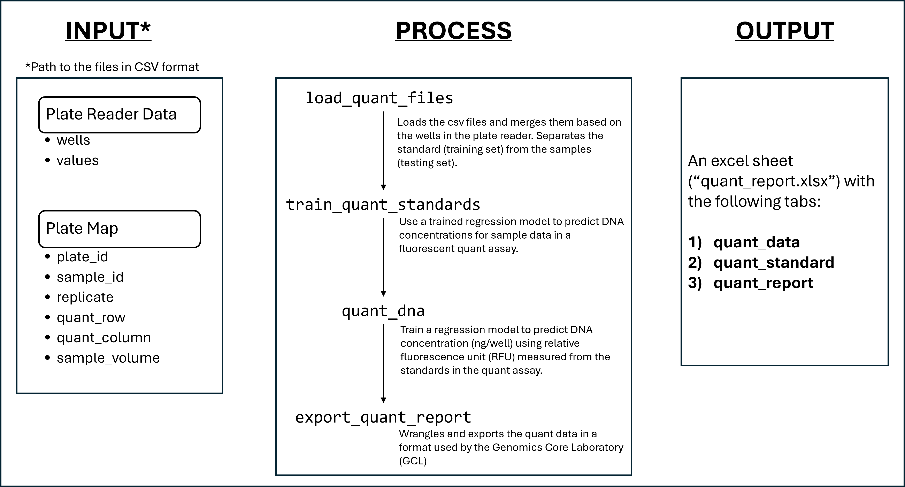
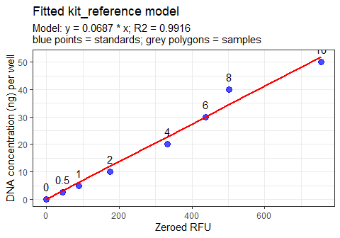
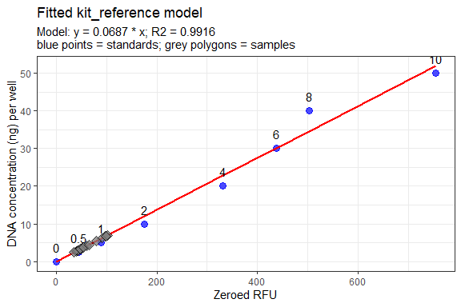
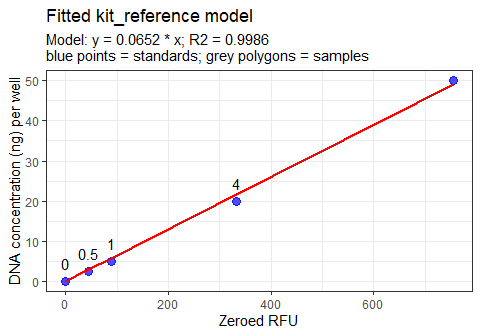
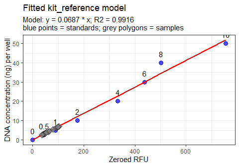

<!-- README.md is generated from README.Rmd. Please edit that file -->

# gclTools

<!-- badges: start -->
<!-- badges: end -->

Collection of R functions to automate computational workflows in TAMU-CC
Genomics Core Laboratory.

This package handles the following:

- Quant (AccuBlue, AccuClear) workflows

## Installation

You can install the development version of gclTools from
[GitHub](https://github.com/) with:

``` r
# install.packages("devtools")
devtools::install_github("tamucc-gcl/gclTools")
```

Once installation is successful, load the library.

``` r
require(tamuccGCL)
#> Loading required package: tamuccGCL
#> Loading required package: openxlsx
#> Loading required package: tidyverse
#> Warning: package 'lubridate' was built under R version 4.4.2
#> ── Attaching core tidyverse packages ──────────────────────── tidyverse 2.0.0 ──
#> ✔ dplyr     1.1.4     ✔ readr     2.1.5
#> ✔ forcats   1.0.0     ✔ stringr   1.5.1
#> ✔ ggplot2   3.5.1     ✔ tibble    3.2.1
#> ✔ lubridate 1.9.4     ✔ tidyr     1.3.1
#> ✔ purrr     1.0.2
#> ── Conflicts ────────────────────────────────────────── tidyverse_conflicts() ──
#> ✖ dplyr::filter() masks stats::filter()
#> ✖ dplyr::lag()    masks stats::lag()
#> ℹ Use the conflicted package (<http://conflicted.r-lib.org/>) to force all conflicts to become errors
#> Loading required package: janitor
#> Warning: package 'janitor' was built under R version 4.4.2
#> 
#> Attaching package: 'janitor'
#> 
#> The following objects are masked from 'package:stats':
#> 
#>     chisq.test, fisher.test
```

If you encounter any issues with this package, please [open an issue on
GitHub](https://github.com/tamucc-gcl/gclTools/issues).

------------------------------------------------------------------------

## Example - Quant Workflow

In a nutshell, the quant workflow takes the file path to the quant data
files (in csv format) as input, trains the regression model based on the
relative fluorescence unit (RFU) of the standards, and then uses the
regression model to predict the DNA concentration of the samples. The
output file, which contains the quant report following the Genomics Core
Lab’s format, is then generated.



------------------------------------------------------------------------

### Step 1 - `load_quant_files()`

The Quant workflow requires two data frames in comma-separated values
(csv) format: (1) the plate reader data, and (2) the plate map. The
**plate reader data** is the raw data exported from the SpectraMax
software, and should contain the columns, `wells` and `values`. On the
other hand, the **plate map** is a user-defined file that contains the
well information and metadata associated with the samples in the assay.
The data structure is specific and should only have the following
columns: `plate_id`, `sample_id`, `replicate`, `quant_row`,
`quant_column`, and `sample_volume`.

``` r
# Import data files
raw_data <- system.file("extdata", "raw_data.csv", package = "tamuccGCL") 
plate_map <- system.file("extdata", "plate_map.csv", package = "tamuccGCL")
```

> Do note that the files used in the example are included in the
> package. Substitute the arguments with the file path to your csv
> files.

Once the file paths are provided, they are read, validated, and merged
using the `load_quant_files()` function. The output of
`load_quant_files()` is a list with two data frames: (1) `sample`, and
(2) `standard`. The latter is used to train the regression model using
the function `train_quant_standards()`.

``` r
quant_data <- load_quant_files(raw_data, plate_map)
#> 8 standards detected
#> The standards used (in ng/ul) are: 0, 0.5, 1, 2, 4, 6, 8, 10
print(quant_data)
#> $sample
#>                      plate_id sample_id replicate quant_row quant_column
#> 1  Tepolt-ddRAD-LibraryPlate2       A12         1         O            1
#> 2  Tepolt-ddRAD-LibraryPlate2       B12         1         O            3
#> 3  Tepolt-ddRAD-LibraryPlate2       C12         1         O            5
#> 4  Tepolt-ddRAD-LibraryPlate2       D12         1         O            7
#> 5  Tepolt-ddRAD-LibraryPlate2       E12         1         O            9
#> 6  Tepolt-ddRAD-LibraryPlate2       F12         1         O           11
#> 7  Tepolt-ddRAD-LibraryPlate2       G12         1         O           13
#> 8  Tepolt-ddRAD-LibraryPlate2       H12         1         O           15
#> 9  Tepolt-ddRAD-LibraryPlate2       A12         2         O            2
#> 10 Tepolt-ddRAD-LibraryPlate2       B12         2         O            4
#> 11 Tepolt-ddRAD-LibraryPlate2       C12         2         O            6
#> 12 Tepolt-ddRAD-LibraryPlate2       D12         2         O            8
#> 13 Tepolt-ddRAD-LibraryPlate2       E12         2         O           10
#> 14 Tepolt-ddRAD-LibraryPlate2       F12         2         O           12
#> 15 Tepolt-ddRAD-LibraryPlate2       G12         2         O           14
#> 16 Tepolt-ddRAD-LibraryPlate2       H12         2         O           16
#>    sample_volume wells     rfu
#> 1              1    O1  53.678
#> 2              1    O3 102.849
#> 3              1    O5  44.554
#> 4              1    O7  48.778
#> 5              1    O9  94.981
#> 6              1   O11  65.727
#> 7              1   O13  84.385
#> 8              1   O15  45.725
#> 9              1    O2  55.734
#> 10             1    O4 106.916
#> 11             1    O6  48.010
#> 12             1    O8  52.562
#> 13             1   O10 103.989
#> 14             1   O12  59.601
#> 15             1   O14  70.389
#> 16             1   O16  40.956
#> 
#> $standard
#>    plate_id sample_id replicate quant_row quant_column sample_volume wells
#> 17 standard         0         1         P            1             5    P1
#> 18 standard       0.5         1         P            2             5    P2
#> 19 standard         1         1         P            3             5    P3
#> 20 standard         2         1         P            4             5    P4
#> 21 standard         4         1         P            5             5    P5
#> 22 standard         6         1         P            6             5    P6
#> 23 standard         8         1         P            7             5    P7
#> 24 standard        10         1         P            8             5    P8
#>        rfu
#> 17   4.814
#> 18  48.950
#> 19  93.887
#> 20 180.096
#> 21 336.554
#> 22 441.693
#> 23 507.526
#> 24 759.432
```

------------------------------------------------------------------------

### Step 2 - `train_quant_standards()`

This function takes the standard data frame from `load_quant_files()`,
subtracts the background RFU (i.e., the RFU of the 0 ng/uL standard)
from the rest of the standards, and then use the resulting `zeroed_rfu`
for the regression model.

There are three models to choose from:

- **kit_reference** - $[DNA] = 0 + b(RFU)$ (this zero-intercept model is
  the one used in the product manual, and is thus the default when no
  arguments are provided.
- **linear** - $[DNA] = a + b(RFU)$ (a linear model with non-zero
  intercept)
- **power** - $[DNA] = exp(a) * RFU^b$ (this model is used when there is
  a need to normalize the standard concentrations. The regression model
  is defined as `log(DNA) ~ log(RFU)`.

The output is a list that contains the objects needed in succeeding
steps. A scatterplot with the regression line allows assessment of the
model.

``` r
trained_model <- train_quant_standards(quant_data)
#> No replicate standards detected. Original RFU values are kept.
#> Fitted a kit_reference model.
#> Coefficients: zeroed_rfu = 0.0687
#> R-squared: 0.9916
```

``` r
print(trained_model)
#> $background_rfu
#> [1] 4.814
#> 
#> $standard
#>    plate_id sample_id     rfu dna_per_ul dna_per_well zeroed_rfu          fit
#> 17 standard       0.0   4.814        0.0          0.0      0.000 3.330669e-15
#> 18 standard       0.5  48.950        0.5          2.5     44.136 3.030008e+00
#> 19 standard       1.0  93.887        1.0          5.0     89.073 6.115006e+00
#> 20 standard       2.0 180.096        2.0         10.0    175.282 1.203339e+01
#> 21 standard       4.0 336.554        4.0         20.0    331.740 2.277449e+01
#> 22 standard       6.0 441.693        6.0         30.0    436.879 2.999245e+01
#> 23 standard       8.0 507.526        8.0         40.0    502.712 3.451199e+01
#> 24 standard      10.0 759.432       10.0         50.0    754.618 5.180575e+01
#> 
#> $model_fit
#> 
#> Call:
#> lm(formula = dna_per_well ~ 0 + zeroed_rfu, data = std)
#> 
#> Coefficients:
#> zeroed_rfu  
#>    0.06865  
#> 
#> 
#> $r_squared
#> [1] 0.9915506
#> 
#> $plot
```



In instances when standards need to be removed to improve model fit
$(R^2)$, the argument `remove_standard` can be used. It accepts a
numeric vector.

``` r
# Remove one standard
model_with_standards_removed <-  train_quant_standards(quant_data,
                                                       model = "power", 
                                                       remove_standard = 2)
#> No replicate standards detected. Original RFU values are kept.
#> Removing the following standards: 2
#> Warning in train_quant_standards(quant_data, model = "power", remove_standard =
#> 2): 1 standards with zeroed_rfu <=0 were removed for the power model. See plot
#> for more details.
#> Fitted a power model.
#> Coefficients: (Intercept) = -3.2466, log(zeroed_rfu) = 1.0908
#> R-squared: 0.9948
#> Warning: Removed 1 row containing missing values or values outside the scale range
#> (`geom_line()`).
```



``` r

# Remove three standards
model_with_standards_removed <- train_quant_standards(quant_data,
                                                      remove_standard = c(2, 6, 8)
                                                      )
#> No replicate standards detected. Original RFU values are kept.
#> Removing the following standards: 2, 6, 8
#> Fitted a kit_reference model.
#> Coefficients: zeroed_rfu = 0.0652
#> R-squared: 0.9986
```



------------------------------------------------------------------------

### Step 3 - `quant_dna()`

The model generated from Step 2 will be used to predict the DNA
concentrations (ng/well and ng/uL) from the sample data frame. This is a
pretty straightforward step - you only need to provide the objects
generated from both Steps 1 and 2.

Similar to how the training dataset was prepared, the background RFU
will be subtracted from the sample RFU, and the `zeroed_rfu` will be
used for predicting the DNA concentration. In addition, the plot from
Step 2 will be updated to show the location of the samples along the
regression line.

``` r
quant_report <- quant_dna(quant_data = quant_data, trained_model = trained_model)
```

``` r
print(quant_report)
#> $quant_output
#>                      plate_id sample_id replicate quant_row quant_column
#> 1  Tepolt-ddRAD-LibraryPlate2       A12         1         O            1
#> 2  Tepolt-ddRAD-LibraryPlate2       B12         1         O            3
#> 3  Tepolt-ddRAD-LibraryPlate2       C12         1         O            5
#> 4  Tepolt-ddRAD-LibraryPlate2       D12         1         O            7
#> 5  Tepolt-ddRAD-LibraryPlate2       E12         1         O            9
#> 6  Tepolt-ddRAD-LibraryPlate2       F12         1         O           11
#> 7  Tepolt-ddRAD-LibraryPlate2       G12         1         O           13
#> 8  Tepolt-ddRAD-LibraryPlate2       H12         1         O           15
#> 9  Tepolt-ddRAD-LibraryPlate2       A12         2         O            2
#> 10 Tepolt-ddRAD-LibraryPlate2       B12         2         O            4
#> 11 Tepolt-ddRAD-LibraryPlate2       C12         2         O            6
#> 12 Tepolt-ddRAD-LibraryPlate2       D12         2         O            8
#> 13 Tepolt-ddRAD-LibraryPlate2       E12         2         O           10
#> 14 Tepolt-ddRAD-LibraryPlate2       F12         2         O           12
#> 15 Tepolt-ddRAD-LibraryPlate2       G12         2         O           14
#> 16 Tepolt-ddRAD-LibraryPlate2       H12         2         O           16
#>    sample_volume wells     rfu zeroed_rfu dna_per_well dna_per_ul
#> 1              1    O1  53.678     48.864     3.354593   3.354593
#> 2              1    O3 102.849     98.035     6.730262   6.730262
#> 3              1    O5  44.554     39.740     2.728215   2.728215
#> 4              1    O7  48.778     43.964     3.018200   3.018200
#> 5              1    O9  94.981     90.167     6.190111   6.190111
#> 6              1   O11  65.727     60.913     4.181776   4.181776
#> 7              1   O13  84.385     79.571     5.462678   5.462678
#> 8              1   O15  45.725     40.911     2.808606   2.808606
#> 9              1    O2  55.734     50.920     3.495740   3.495740
#> 10             1    O4 106.916    102.102     7.009468   7.009468
#> 11             1    O6  48.010     43.196     2.965475   2.965475
#> 12             1    O8  52.562     47.748     3.277978   3.277978
#> 13             1   O10 103.989     99.175     6.808524   6.808524
#> 14             1   O12  59.601     54.787     3.761216   3.761216
#> 15             1   O14  70.389     65.575     4.501830   4.501830
#> 16             1   O16  40.956     36.142     2.481207   2.481207
#> 
#> $plot
```



    #> 
    #> $standard
    #>    plate_id sample_id     rfu dna_per_ul dna_per_well zeroed_rfu          fit
    #> 17 standard       0.0   4.814        0.0          0.0      0.000 3.330669e-15
    #> 18 standard       0.5  48.950        0.5          2.5     44.136 3.030008e+00
    #> 19 standard       1.0  93.887        1.0          5.0     89.073 6.115006e+00
    #> 20 standard       2.0 180.096        2.0         10.0    175.282 1.203339e+01
    #> 21 standard       4.0 336.554        4.0         20.0    331.740 2.277449e+01
    #> 22 standard       6.0 441.693        6.0         30.0    436.879 2.999245e+01
    #> 23 standard       8.0 507.526        8.0         40.0    502.712 3.451199e+01
    #> 24 standard      10.0 759.432       10.0         50.0    754.618 5.180575e+01

------------------------------------------------------------------------

### Step 4 - `export_quant_report()`

This step takes the output from Step 3, wrangles the quant results into
the format used by the GCL, and saves the output as an excel file.

``` r
export_quant_report(quant_report)
#> Quant report exported successfully!
#> # A tibble: 8 × 18
#>   plate_id       sample_row sample_column quant_row_1 quant_column_1 quant_row_2
#>   <chr>          <chr>              <dbl> <chr>                <int> <chr>      
#> 1 Tepolt-ddRAD-… A                     12 O                        1 O          
#> 2 Tepolt-ddRAD-… B                     12 O                        3 O          
#> 3 Tepolt-ddRAD-… C                     12 O                        5 O          
#> 4 Tepolt-ddRAD-… D                     12 O                        7 O          
#> 5 Tepolt-ddRAD-… E                     12 O                        9 O          
#> 6 Tepolt-ddRAD-… F                     12 O                       11 O          
#> 7 Tepolt-ddRAD-… G                     12 O                       13 O          
#> 8 Tepolt-ddRAD-… H                     12 O                       15 O          
#> # ℹ 12 more variables: quant_column_2 <int>, raw_rfu_1 <dbl>,
#> #   zeroed_rfu_1 <dbl>, ng_well_1 <dbl>, ng_ul_1 <dbl>, raw_rfu_2 <dbl>,
#> #   zeroed_rfu_2 <dbl>, ng_well_2 <dbl>, ng_ul_2 <dbl>, difference <dbl>,
#> #   average <dbl>, pass_redo <chr>
```

The excel file is saved in the current working directory. This file has
three tabs:

- `quant_data` - the quant results of the samples in tall format

- `quant_standard` - the quant results of the standard, along with the
  regression plot for inspection

- `quant_report` - the quant results of the samples in wide format
  (i.e., GCL format)

------------------------------------------------------------------------

# Changelog

Here are the list of changes done to this package:

### 2025-01-21

**Housekeeping**

- Changed package name from `tamuccGCL` to `gclTools`. Changes were also
  done on associated files
- Added lines for each section in the readme
- Removed the whitespace in presenting the function (i.e., from
  `function (argument)` to `function(argument)`)
- Redirected issues to the package’s Issue page on `Github` instead of
  emailing K.Labrador
- Added `package.Rd` to allow a brief documentation when calling the
  package

**Functionality**
